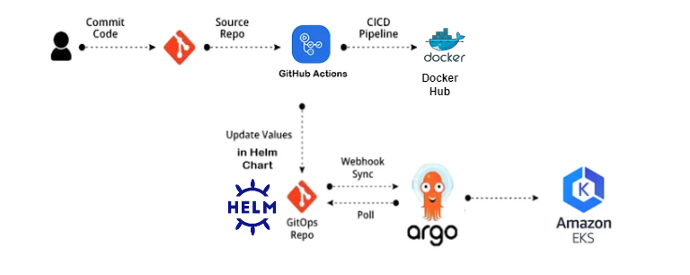
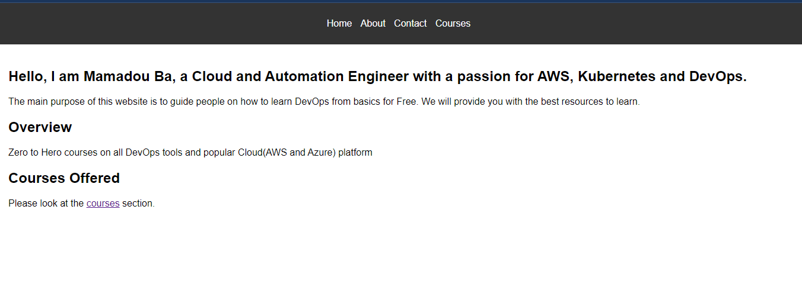

# Pipeline CI/CD pour une Application Golang

Ce projet met en place un pipeline CI/CD pour une application Golang en utilisant divers outils modernes tels que Docker, Kubernetes, Helm, Nginx Ingress, ArgoCD et GitHub Actions.

## Table des matières

- [Introduction](#introduction)
- [Technologies Utilisées](#technologies-utilisées)
- [Architecture](#architecture)
- [Déploiement](#déploiement)
## Introduction

Ce projet vise à automatiser le processus de build, de test et de déploiement d'une application Golang. Le pipeline CI/CD garantit que chaque changement de code est automatiquement testé et déployé dans l'environnement Kubernetes.

## Technologies Utilisées

- **Golang** : Langage de programmation pour le développement de l'application.
- **Docker** : Containerisation de l'application.
- **Kubernetes** : Orchestration des conteneurs.
- **Helm** : Gestionnaire de paquets pour Kubernetes.
- **Nginx Ingress** : Contrôleur Ingress pour gérer l'accès aux services dans le cluster Kubernetes.
- **ArgoCD** : Outil de déploiement continu pour Kubernetes.
- **GitHub Actions** : Plateforme CI/CD pour l'automatisation des workflows.

## Architecture

L'architecture du projet est la suivante :



1. **Code Source** : Le code source de l'application est hébergé sur GitHub.
2. **Pipeline CI/CD** :
   - **Build et Test** : GitHub Actions est utilisé pour construire et tester l'application.
   - **Image Docker** : Une image Docker est construite et poussée vers docker hub.
3. **Déploiement** :
   - **Helm Charts** : Les charts Helm sont utilisés pour décrire les ressources Kubernetes nécessaires.
   - **ArgoCD** : ArgoCD surveille le dépôt de configuration et synchronise l'état du cluster Kubernetes avec les charts Helm.


## déploiement

Ceci est un site web simple écrit en Golang. Il utilise le paquet `net/http` pour servir les requêtes HTTP.

### Lancement de l'application

Pour lancer le serveur, exécutez la commande suivante :

```bash
go run main.go
```

Le serveur démarrera sur le port 8080. Vous pouvez y accéder en naviguant vers `http://localhost:8080/courses` dans votre navigateur web.

### Looks like this




